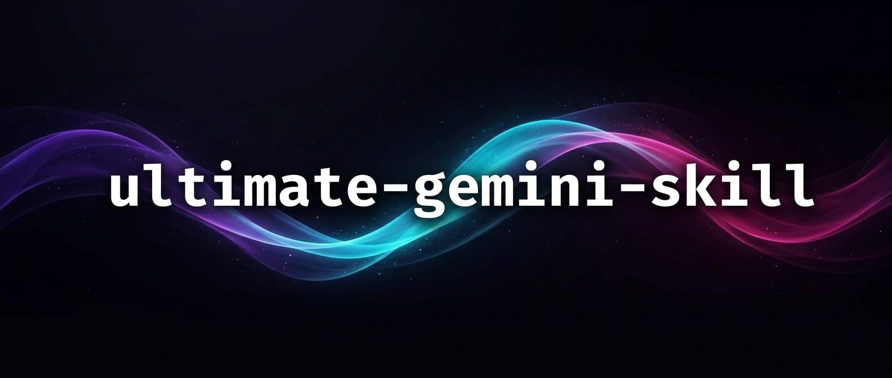
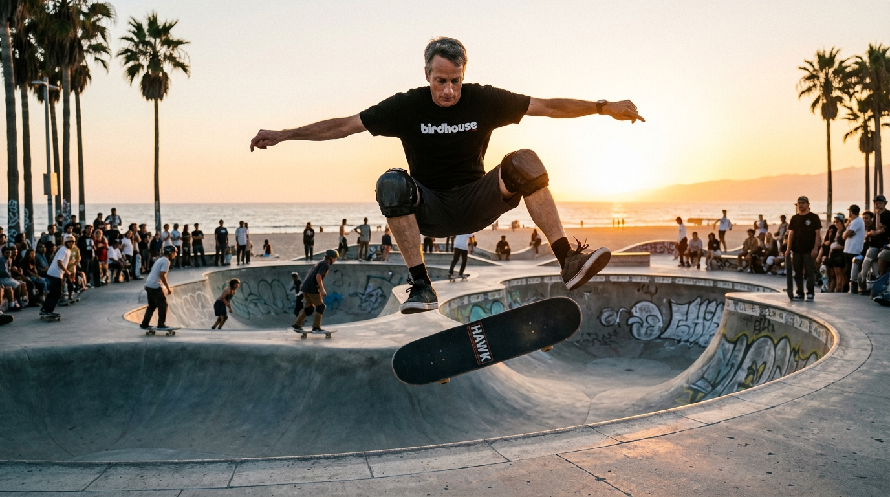
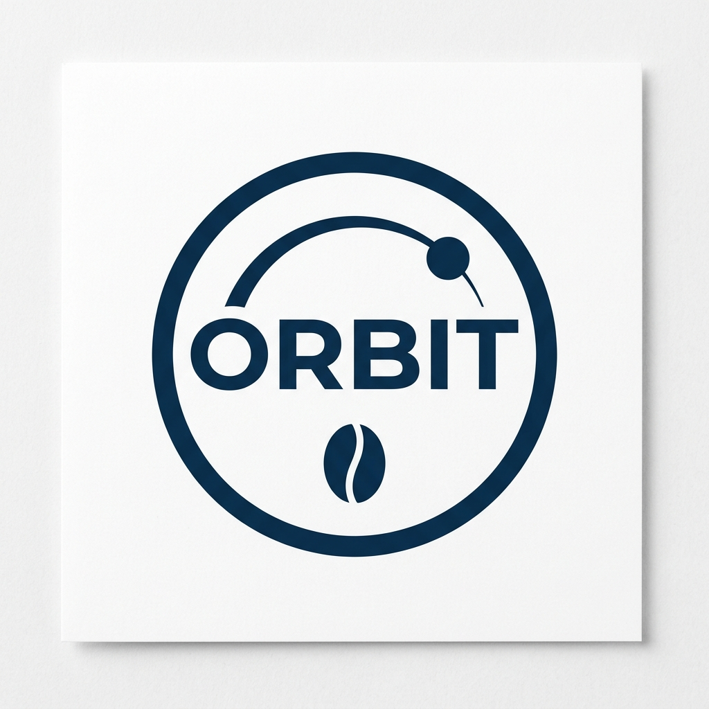
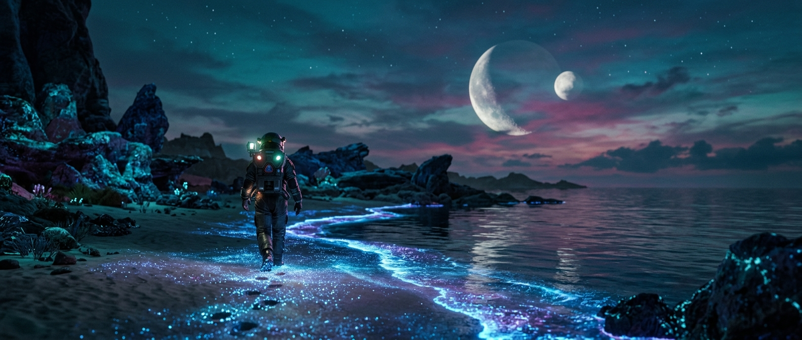

# ultimate-gemini-skill



## 🚀 Easiest way to install

One command — no git clone, no manual copying:

```bash
npx skills add bradAGI/ultimate-gemini-skill
```

That's it. Auto-detects your coding agent and drops the skill in the right place.

### Works with every agent supported by [skills.sh](https://skills.sh)

This skill is agent-agnostic. The `npx skills add` installer supports **19+ coding agents / IDEs**, including:

**Claude Code** · **Cursor** · **Windsurf** · **Codex** · **Cline** · **GitHub Copilot** · **Gemini** · **VSCode** · **Goose** · **AMP** · **Antigravity** · **ClawdBot** · **Droid** · **Kilo** · **Kiro CLI** · **Nous Research** · **OpenCode** · **Roo** · **Trae**

If your agent loads skills from a standard `skills/` or similar directory, the installer will place the files correctly. You can also install manually (see below) — the skill itself is just a `SKILL.md` + a Python CLI, so any harness that can read a markdown skill definition can use it.

After installing, set `GEMINI_API_KEY` (see [Securing your API key](#securing-your-api-key) below) and run `pip install google-genai pillow` once for the bundled CLI.

---

A **standalone, agent-agnostic** skill for Gemini 3.1 Flash Image (Nano Banana 2). Ships a self-contained Python CLI — `scripts/gemini_image.py` — that is a 1:1 mirror of the tools exposed by the [`ultimate-image-gen-mcp`](https://github.com/anand-92/ultimate-image-gen-mcp) by [@anand-92](https://github.com/anand-92), which this skill is derived from. All credit for the underlying tool design, prompt templates, and MCP implementation goes to the original author.

> The banner above was generated by the skill itself — `generate-image --aspect-ratio 21:9 --image-size 1K`.

**No MCP server required.** The skill calls the Gemini API directly. Same params, same defaults, same JSON output shape as the MCP.

## Samples

All three generated with this skill at **1K**, rendered by `scripts/gemini_image.py`. Commands shown.

### 1. Real-world grounded photo (Google Search + Image Search)



```bash
python3 scripts/gemini_image.py generate-image \
  --prompt "Tony Hawk performing a kickflip at Venice Beach skatepark, golden hour, editorial sports photography" \
  --aspect-ratio 16:9 --image-size 1K \
  --enable-google-search --enable-image-search
```

The model grounded on live Google results — note the accurate "birdhouse" shirt (Tony Hawk's skate brand) and the real Venice Beach setting.

### 2. Logo with legible text (`thinking_level: high`)



```bash
python3 scripts/gemini_image.py generate-image \
  --prompt "Modern minimalist logo for a coffee brand called 'Orbit', clean circular wordmark, deep blue on white, flat vector, strong silhouette" \
  --aspect-ratio 1:1 --image-size 1K \
  --response-modalities IMAGE --thinking-level high
```

Gemini 3.1 Flash renders text inside images legibly — hard for most image models.

### 3. Cinematic 21:9 scene



```bash
python3 scripts/gemini_image.py generate-image \
  --prompt "Cinematic still of a lone astronaut walking across a bioluminescent alien beach at dusk, two moons on the horizon, ARRI Alexa anamorphic, teal and magenta color grade" \
  --aspect-ratio 21:9 --image-size 1K
```

## What it gives your agent

- **Triggers** — broad description so the skill fires on "make an image", "design a logo", "give me a banner", "storyboard this", etc.
- **Decision tree** — single vs batch, when to enable Google Search / Image Search grounding, when to bump `thinking_level: high`.
- **User defaults** — documents overrides for `image_size: 1K` and `aspect_ratio: 21:9` for banners.
- **Parameter reference** — full schema, 14 aspect ratios, sizes, formats, modalities, env vars (`references/parameters.md`).
- **26 prompt templates** — photography, cinematic, logo, macro, fashion, storyboard, archviz, isometric, food, and more (`references/templates.md`).
- **Bundled CLI** — `scripts/gemini_image.py` with `generate-image` and `batch-generate` subcommands.

## CLI ↔ MCP mapping

| MCP tool         | CLI subcommand    |
|------------------|-------------------|
| `generate_image` | `generate-image`  |
| `batch_generate` | `batch-generate`  |

Every MCP parameter has a kebab-case CLI flag of the same name (e.g. `enable_google_search` → `--enable-google-search`). Defaults match exactly.

## Options at a glance

**`--image-size`** (default: `2K`; user-preferred: `1K`)
| Value    | Use for                                       |
|----------|-----------------------------------------------|
| `512px`  | Fastest, cheapest — thumbnails, quick iteration |
| `1K`     | Everyday use, good balance                    |
| `2K`     | Server default — balanced quality             |
| `4K`     | Print, hero shots, final deliverables         |

**`--aspect-ratio`** (default: `1:1`) — all 14 options:
`1:1` · `2:3` · `3:2` · `3:4` · `4:3` · `4:5` · `5:4` · `9:16` · `16:9` · `21:9` · `1:4` · `1:8` · `4:1` · `8:1`

- Square / social → `1:1`
- Portrait → `4:5`, `2:3`
- Landscape → `3:2`, `4:3`
- Mobile / story → `9:16`
- YouTube / widescreen → `16:9`
- Cinematic / banner / hero → `21:9`
- Pano strips → `4:1`, `8:1`, `1:4`, `1:8`

**`--output-format`**: `png` (default), `jpeg`, `webp`
**`--thinking-level`**: `minimal` (default, fast), `high` (slower, higher quality)
**`--response-modalities`**: `TEXT IMAGE` (default), or `IMAGE` only (cleaner for logos/textures)
**Reference images**: up to 14 via `--reference-image-paths` (10 objects + 4 characters)
**Batch cap**: 8 prompts per `batch-generate` call, run in parallel

## Prerequisites

- Python 3.11+
- `pip install google-genai pillow`
- `GEMINI_API_KEY` (or `GOOGLE_API_KEY`) in the environment — free key: https://aistudio.google.com/app/apikey

## Install the skill

**Recommended (one command):**

```bash
npx skills add bradAGI/ultimate-gemini-skill
```

**Manual alternative** (if you don't have `npx` or prefer to see what lands where):

```bash
git clone https://github.com/bradAGI/ultimate-gemini-skill.git
mkdir -p ~/.claude/skills/ultimate-gemini-mcp
cp -r ultimate-gemini-skill/SKILL.md \
      ultimate-gemini-skill/references \
      ultimate-gemini-skill/scripts \
      ~/.claude/skills/ultimate-gemini-mcp/
```

Or install the packaged [`dist/ultimate-gemini-mcp.skill`](dist/ultimate-gemini-mcp.skill) via whatever skill installer your harness supports.

## Use the CLI directly

```bash
# Single image
python3 scripts/gemini_image.py generate-image \
  --prompt "Tony Hawk kickflip" \
  --aspect-ratio 16:9 \
  --image-size 1K \
  --enable-google-search

# Parallel batch (up to 8)
python3 scripts/gemini_image.py batch-generate \
  --prompts "scene 1 ..." "scene 2 ..." "scene 3 ..." "scene 4 ..." \
  --aspect-ratio 21:9 \
  --image-size 1K

# With reference images
python3 scripts/gemini_image.py generate-image \
  --prompt "same character, new pose" \
  --reference-image-paths /abs/path/char1.png /abs/path/char2.png
```

Images save to `$GEMINI_OUTPUT_DIR` (default `~/gemini_images`). Override model via `GEMINI_IMAGE_MODEL` and batch cap via `GEMINI_MAX_BATCH_SIZE`.

## Securing your API key

Never commit `GEMINI_API_KEY`. Recommended, in order:

1. **Secrets manager** — 1Password CLI (`op read "op://Private/Gemini/api_key"`) or Bitwarden CLI. Key never on disk in plaintext.
2. **OS keychain** — `secret-tool` (Linux/WSL), macOS Keychain, Windows Credential Manager. Export from a `~/.bashrc` wrapper.
3. **Restricted file** — `chmod 600 ~/.secrets/gemini.env`, then `source` it from your shell rc. Fine for single-user machines.
4. **MCP config env block** — plaintext, so `chmod 600` the config file.

Always add `.env`, `*.key`, and `claude_desktop_config.json` to `.gitignore`. Rotate immediately on exposure.

## Layout

```
.
├── SKILL.md                 # skill triggers + workflow
├── scripts/
│   └── gemini_image.py      # standalone CLI (mirrors the MCP tools)
├── references/
│   ├── parameters.md        # full param schema
│   └── templates.md         # 26 prompt recipes
├── banner.png
└── dist/
    └── ultimate-gemini-mcp.skill
```

## Credits

Derived from [`anand-92/ultimate-image-gen-mcp`](https://github.com/anand-92/ultimate-image-gen-mcp) by [@anand-92](https://github.com/anand-92) — the original MCP server whose tool surface, parameters, and 26 prompt templates this skill mirrors. Please star the upstream project.

## License

MIT — see [LICENSE](LICENSE).
